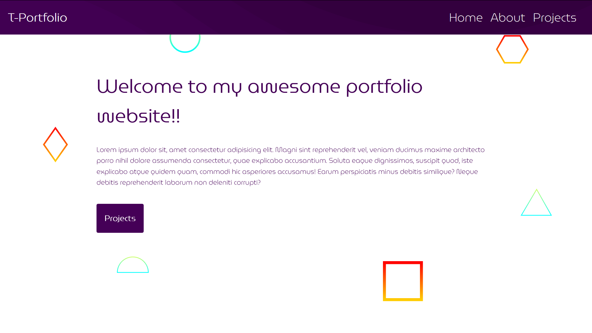
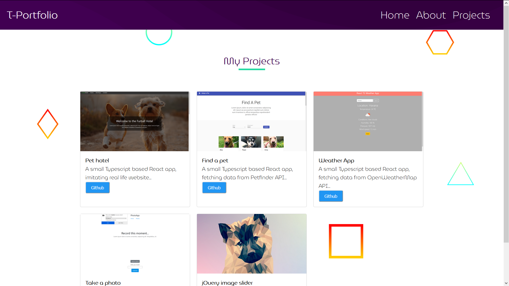

# test-flask

This is my first Flask practice project. It is a small portfolio website, with three pages and their respective endpoints defined in 'app.py'.

As it turned out, the bulk of the project was oriented towards css (having in mind that this project has a bare minimum of flask set up).

Also, it has barba.js and gsap libraries for page animations (functions are defined in 'main.js').

## Screenshots:

 
